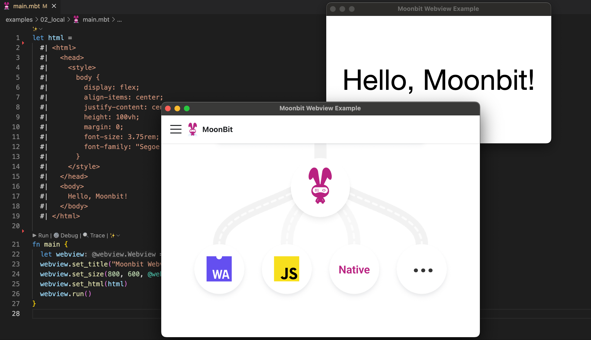

# MoonBit WebView

MoonBit bindings for [webview](https://github.com/webview/webview), a tiny
cross-platform library for creating modern web-based desktop applications using
HTML, CSS, and JavaScript.

## ✨ Features

- 🚀 **Lightweight**: Minimal overhead with native performance
- 🎨 **Modern UI**: Build desktop apps using web technologies
- 🔄 **Cross-platform**: Works on Windows, macOS, and Linux
- 📱 **Responsive**: Native window management and controls
- 🔌 **JavaScript Bridge**: Seamless communication between MoonBit and web
  content
- 🛡️ **Type-safe**: Full MoonBit type safety for WebView operations

> ⚠️ **Note**: This project is currently in active development. APIs may change
> in future releases.



## 📦 Installation

Add `justjavac/webview` to your project dependencies:

```shell
moon update
moon add justjavac/webview
```

## ⚙️ Configuration

Configure your `moon.pkg.json` file to link with the webview library:

```json
{
  "is-main": true,
  "link": {
    "native": {
      "cc-flags": "-fwrapv -fsanitize=address -fsanitize=undefined",
      "cc-link-flags": "-L .mooncakes/justjavac/webview/lib -lwebview"
    }
  }
}
```

## 🔧 Environment Setup

### macOS

Set the dynamic library path:

```shell
export DYLD_LIBRARY_PATH="$(pwd)/.mooncakes/justjavac/webview/lib"
```

### Windows

#### Command Prompt

```bat
set _CL_=/link /LIBPATH:.mooncakes\justjavac\webview\lib webview.lib /DEBUG
set PATH=%PATH%;.mooncakes\justjavac\webview\lib
```

#### PowerShell

```powershell
$env:_CL_="/link /LIBPATH:.mooncakes\justjavac\webview\lib webview.lib /DEBUG"
$env:PATH="$env:PATH;.mooncakes\justjavac\webview\lib"
```

### Linux

```shell
export LD_LIBRARY_PATH="$(pwd)/.mooncakes/justjavac/webview/lib:$LD_LIBRARY_PATH"
```

## 🚀 Quick Start

Here's a simple example to get you started:

```moonbit
let html =
  #| <html>
  #|   <head>
  #|     <title>MoonBit WebView</title>
  #|     <style>
  #|       body { 
  #|         font-family: system-ui, -apple-system, sans-serif;
  #|         display: flex;
  #|         justify-content: center;
  #|         align-items: center;
  #|         height: 100vh;
  #|         margin: 0;
  #|         background: linear-gradient(135deg, #667eea 0%, #764ba2 100%);
  #|         color: white;
  #|       }
  #|       h1 { text-align: center; font-size: 2.5em; }
  #|     </style>
  #|   </head>
  #|   <body>
  #|     <h1>Hello, MoonBit WebView! 🌙</h1>
  #|   </body>
  #| </html>

fn main {
  @webview.Webview::new(debug=1)
  ..set_title("MoonBit WebView Example")
  ..set_size(800, 600, @webview.SizeHint::None)
  ..set_html(html)
  ..run()
}
```

## 📚 Examples

This repository includes various examples in the `examples/` directory:

- **01_run** - Basic window creation
- **02_local** - Loading local HTML files
- **03_remote** - Loading remote web pages
- **04_user_agent** - Custom user agent configuration
- **05_alert** - JavaScript alerts and dialogs
- **06_onload** - Handling page load events
- **07_inject_js** - Injecting JavaScript code
- **08_eval** - Evaluating JavaScript expressions
- **09_dispatch** - Event dispatching
- **10_bind** - Binding MoonBit functions to JavaScript
- **11_multi_window** - Multiple window management
- **12_embed** - Embedding resources
- **13_todo** - Complete todo application
- **14_beforeunload** - Handling window close events
- **15_close** - Window close management

Run any example:

```shell
moon run --target native -C examples <example_name>
```

## 🛠️ Development

### Prerequisites

- [MoonBit toolchain](https://www.moonbitlang.com/)
- CMake 3.15 or higher
- Ninja build system
- C/C++ compiler (GCC, Clang, or MSVC)

### Building from Source

1. **Clone and build dependencies:**
   ```shell
   cmake -G Ninja -B build -S . -D CMAKE_BUILD_TYPE=Release
   cmake --build build
   ```

2. **Set up environment variables:**
   ```shell
   # macOS
   export DYLD_LIBRARY_PATH="$(pwd)/lib"

   # Windows (Command Prompt)
   set _CL_=/link /LIBPATH:lib webview.lib /DEBUG
   set PATH=%PATH%;lib

   # Windows (PowerShell)
   $env:_CL_="/link /LIBPATH:lib webview.lib /DEBUG"
   $env:PATH="$env:PATH;lib"

   # Linux
   export LD_LIBRARY_PATH="$(pwd)/lib:$LD_LIBRARY_PATH"
   ```

3. **Install dependencies and run examples:**
   ```shell
   moon update
   moon install
   moon run --target native -C examples 02_local
   ```

### Running Tests

```shell
moon test --target native
```

## 📄 License

MIT License © [justjavac](https://github.com/justjavac)

<div align="center">
  <strong>Made with ❤️ and MoonBit</strong>
</div>
