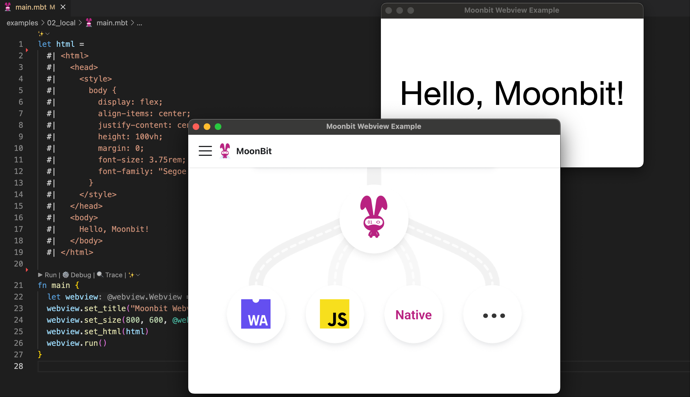

# justjavac/webview

MoonBit bindings for webview, a tiny library for creating web-based desktop
GUIs.

> ⚠️ This project is still in development.



## Installation

Add `justjavac/webview` to your dependencies:

```shell
moon update
moon add justjavac/webview
```

## Config

Config your `moon.pkg.json` file:

```json
{
  "is-main": true,
  "link": {
    "native": {
      "cc-flags": "-fwrapv -fsanitize=address -fsanitize=undefined",
      "cc-link-flags": "-L build/lib -lwebview"
    }
  }
}
```

## Usage

```moonbit
let html =
  #| <html>
  #|   <body>
  #|     Hello, Moonbit!
  #|   </body>
  #| </html>

fn main {
  @webview.Webview::new(debug=1)
  ..set_title("Moonbit Webview Example")
  ..set_size(800, 600, @webview.SizeHint::None)
  ..set_html(html)
  ..run()
}
```

## Development

Build and test:

```shell
cmake -G Ninja -B build -S . -D CMAKE_BUILD_TYPE=Release
cmake --build build
export DYLD_LIBRARY_PATH="$(pwd)/build/lib"

moon install
moon run --target native examples/02_local
```

## License

MIT © justjavac
